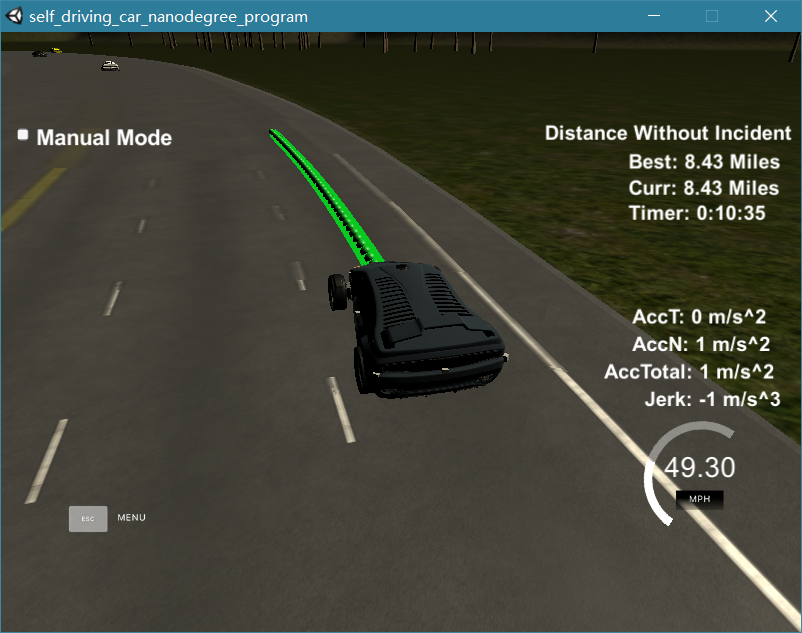

# CarND-Path-Planning-Project
Self-Driving Car Engineer Nanodegree Program

## The rubric
### **1.Compilation.**
My code compiled without errors.
### **2.Valid Trajectories**
* My car is able to drive at least 4.32 miles without incident.
* The car drives according to the speed limit.
* Max Acceleration and Jerk are not Exceeded.
* My car does not have collisions.
* My car stays in its lane, except for the time between changing lanes.
* My car is able to change lanes

 

### **3.The code model for generating paths**
* **Path generate**

I used spline method to generate path point just as the walkthrough video used. But there are little diffents.
I did't use constant speed to generate points as the video said. I added the acceleration when I gennerate points. The two pictures in below indicated the differents. The code located in **`main.cpp line 468 to 480`**.

* **Path planning**

My car will keep in its lane most time. When my car meet a slow car in front then my car will consider to change lane. The step about how I make decision is:

1. Pick out the closest cars.

I pick out the closest cars in left lane and right lane (if my car in left most or right most just pick out cars in one lane) .Then I can get a scenario showed in below(assuming my car is in midle lane).

 

(FL = front left;
FR = front right;
RL = rear left;
RR = rear right;)

2. Get possible options

According to the scenario I can get the gap in left and right. If the gap is safe to change lane, I can get an option. For example: if the left gap is safe to change I will set the value `change_left = true`.

The code of find closest cars and get options is in **`main.cpp line 312 to 386`**.

3. Make decision

After step 1 and step 2, I can get one of the results showed in below:

|can change to left | can change to right|
|-------------------|--------------------|
|true|true|
|true|false|
|false|true|
|false|false|

If I can cange both to left an right, I will check the FL and FR car's **s**. I prefer to change to the lane whose front car is farther. But when there is no big gap (10m) between FL and FR car's **s**, I will change to the lane whose front car is faster.

If I get only one `true` then I just make my car to do that.

If I get no possible options just make my car keep in lane.

[Here](http://v.youku.com/v_show/id_XMzUwNTQyMTIxMg==.html?spm=a2h0k.8191407.0.0&from=s1.8-1-1.2) is a video about my car make lane changes(regardless the water mark, I used a free software so you know.). 

Here is some pictures for my car doing lane change:

 

